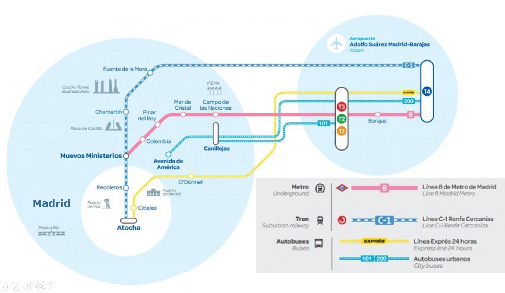
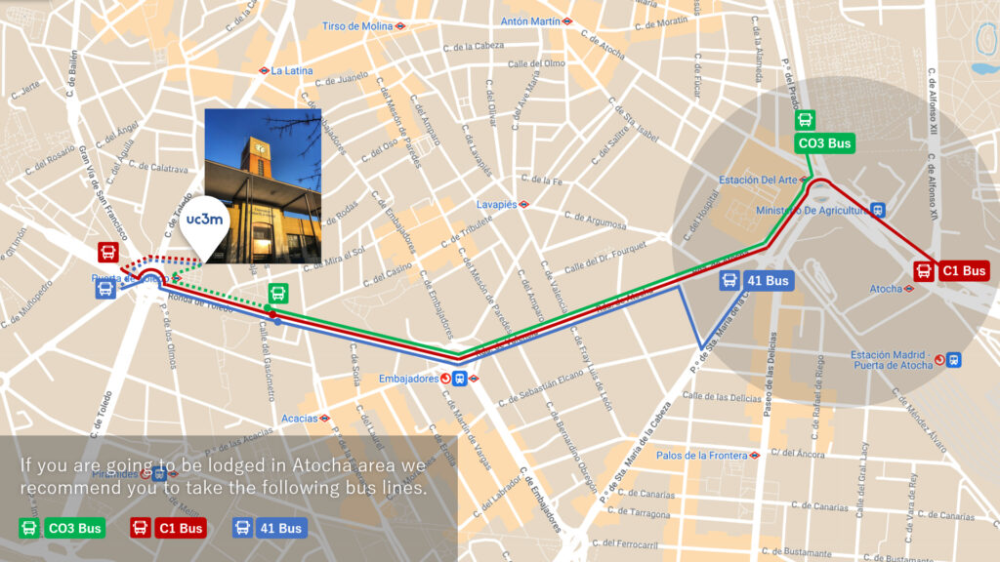

---
hide:
  - toc
---

## Flying to Madrid

**Adolfo Suárez Madrid-Barajas Airport**

Madrid-Barajas Airport (IATA code: MAD, ICAO code: LEMD), is located in the northeast of Madrid, Barajas district, 12 kilometers from the center of Madrid.

The Spanish capital airport changed its name from Madrid-Barajas to Adolfo Suárez Madrid-Barajas in 2014.

Madrid airport is the first Spanish airport in terms of passenger traffic, air cargo, and number of operations. It occupies the 5th position in the classification of European airports according to data from the Eurostat Agency, and is the fifteenth in the world for passenger traffic, according to ACI statistics.

Address:  Av de la Hispanidad, s/n, 28042 Madrid

More information...

[https://www.aena.es/en/adolfo-suarez-madrid-barajas.html](https://www.aena.es/en/adolfo-suarez-madrid-barajas.html)

## From Barajas airport to Madrid city (Atocha train station)

### Subway 

Second largest network in Europe with 302 stations, 220 with disabled access. There are two stations at Barajas airport, in Terminal 2 (T2) and Terminal 4 (T4). 

Ticket price: between €4.50 and €6.00.

### Railway - Cercanias Renfe

Running from 5:30am-11:50pm. When arriving by Terminal 4 (T4), the fastest alternative to get to Atocha. 

Ticket price: €2.50.

### Taxi

The price for a taxi ride from the Madrid-Barajas airport to the centre of Madrid* is a flat rate € 30 one way, it is Fixed airport Rate 4 (see detail of the taxi's basic fare table).

More information...

[https://www.aeropuertomadrid-barajas.com/transportation/madrid-airport-bytaxi.htm](https://www.aeropuertomadrid-barajas.com/transportation/madrid-airport-bytaxi.htm)

### Airport express

Running every 15-20 minutes 24h/365d. Highly recommended if carrying heavy or large luggage. 

Ticket price: €5.00. 

## By Bus from Atocha train station to the conference venue

