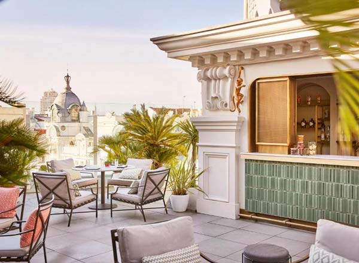
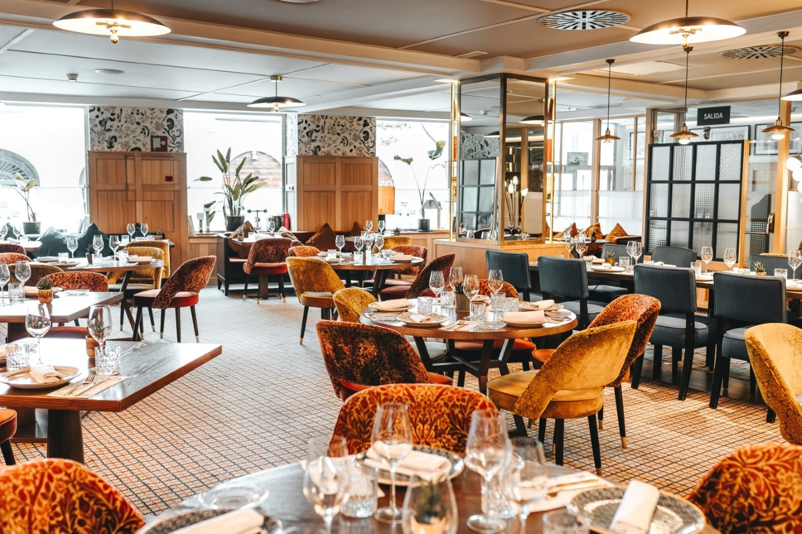

# Program Overview

[Detailed program :fontawesome-solid-paper-plane:](https://easychair.org/smart-program/SBAC-PAD2026/){ .md-button }

# Social events

### Welcome cocktail

**Location**: Hotel Hyat Gran Via
**Address**: [CGran Vía, 31, Centro, 28013 Madrid](https://maps.app.goo.gl/WZvgG6ftTTtG84jw5) 

El Jardín de Diana is an exclusive rooftop bar and restaurant located on the 10th floor of the Hyatt Centric Gran Vía Madrid. Perched high above the city's iconic avenue, this stylish urban oasis offers panoramic views of the Madrid skyline, featuring both an open-air garden terrace and a sophisticated indoor lounge.

The venue takes its name from the goddess of the hunt, whose striking five-meter sculpture crowns the rooftop, aiming her bow across Gran Vía. Visitors can enjoy creative signature cocktails, a curated selection of Spanish tapas, and modern Mediterranean fusion cuisine, making it an ideal spot for sunset drinks, casual dining, or special events in the heart of the capital.

### Banquet

**Location**: Casa Suecia
**Address**: [Marqués de Casa Riera, 4](https://www.google.com/maps/place//data=!4m2!3m1!1s0xd4229859afac2c1:0xaee7f7ff7741e6c2?sa=X&ved=1t:8290&ictx=111) 

Inaugurated in 1956 next to the Círculo de Bellas Artes, Casa Suecia was born as the cultural, diplomatic, and social epicenter of the Scandinavian community in Madrid. Designed by architect Mariano Garrigues, the building originally housed the Scandinavian Center and an exclusive hotel.

The project emerged with the aim of strengthening commercial and cultural ties between Spain and Nordic countries. It was patronized in its early years by King Gustaf VI Adolf of Sweden, immediately becoming a vital meeting point for diplomacy, business, and the Swedish community in the capital.

Following a comprehensive renovation in the early 21st century, the building reopened incorporating the NH Collection Madrid Suecia hotel. The dining and leisure space retained the name Casa Suecia, preserving its historical legacy across several areas:

- Cocktail Bar Hemingway: A speakeasy-style cocktail bar in the basement—hidden behind a door in the restroom area—with 1950s-inspired decor.
- La Terraza: A popular rooftop terrace offering 360-degree views over the city center rooftops.
- The Restaurant: A Mediterranean cuisine space that maintains nods to traditional Swedish gastronomy.

