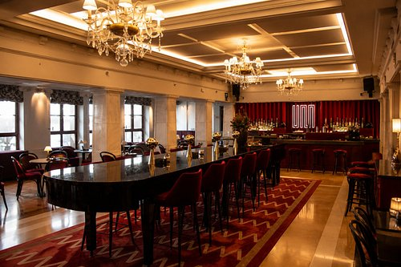

# Program Overview

[Detailed program :fontawesome-solid-paper-plane:](https://easychair.org/smart-program/SBAC-PAD2026/){ .md-button }

# Social events

### Welcome cocktail

**Location**: U-Music
**Address**: [C. de la Paz, 11, Centro, 28012](https://www.google.com/maps/place//data=!4m2!3m1!1s0xd4229aa810859db:0x84f70547186202eb?sa=X&ved=1t:8290&ictx=111) 

UMusic Hotel Madrid represents the transformation of historical heritage into a pioneering concept of musical hospitality, bringing together the iconic Albéniz Theater and the former Hotel Madrid in a single space.

The Albéniz Theater, originally opened in 1945 as a landmark of Madrid's lyrical and theatrical scene, remained closed for years following threats of demolition. Declared a Property of Cultural Interest in 2016 thanks to civic and cultural mobilization, the venue was renovated through an investment of nearly 30 million euros driven by SOCIMI Silicius and operated by UMusic Hotels (a division of Universal Music Group), reopening its doors in late 2022.

The complex does not function as a simple accommodation with themed decor, but as a space where gastronomy, five-star lodging, and performing arts converge.

### Banquet

**Location**: Casa Suecia
**Address**: [Marqués de Casa Riera, 4](https://www.google.com/maps/place//data=!4m2!3m1!1s0xd4229859afac2c1:0xaee7f7ff7741e6c2?sa=X&ved=1t:8290&ictx=111) 

Inaugurated in 1956 next to the Círculo de Bellas Artes, Casa Suecia was born as the cultural, diplomatic, and social epicenter of the Scandinavian community in Madrid. Designed by architect Mariano Garrigues, the building originally housed the Scandinavian Center and an exclusive hotel.

The project emerged with the aim of strengthening commercial and cultural ties between Spain and Nordic countries. It was patronized in its early years by King Gustaf VI Adolf of Sweden, immediately becoming a vital meeting point for diplomacy, business, and the Swedish community in the capital.

Following a comprehensive renovation in the early 21st century, the building reopened incorporating the NH Collection Madrid Suecia hotel. The dining and leisure space retained the name Casa Suecia, preserving its historical legacy across several areas:

- Cocktail Bar Hemingway: A speakeasy-style cocktail bar in the basement—hidden behind a door in the restroom area—with 1950s-inspired decor.
- La Terraza: A popular rooftop terrace offering 360-degree views over the city center rooftops.
- The Restaurant: A Mediterranean cuisine space that maintains nods to traditional Swedish gastronomy.

