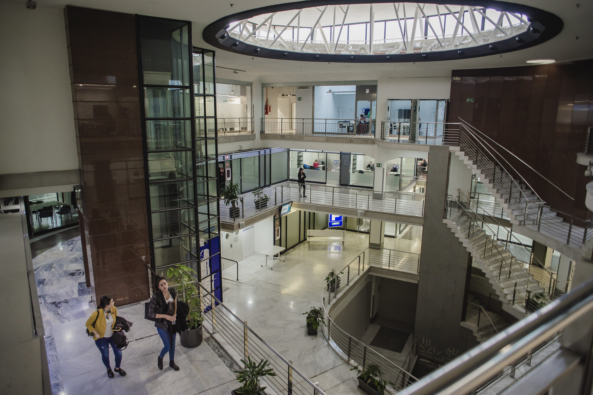
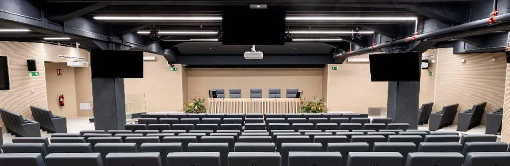
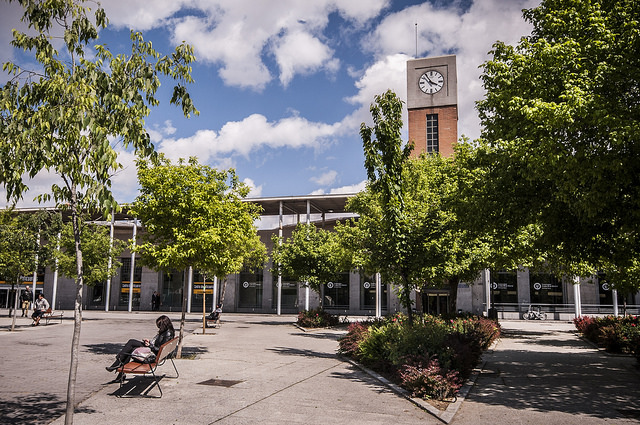
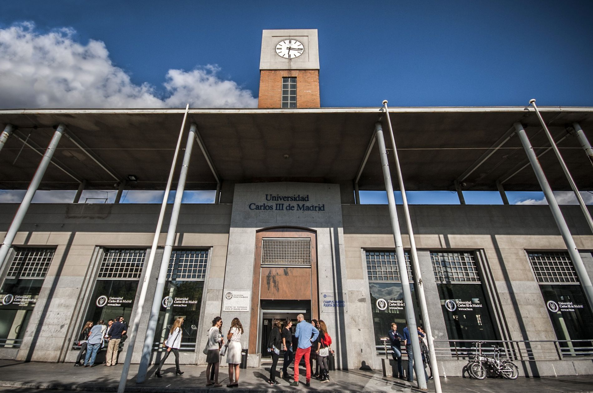

**The conference will take place at the Universidad Carlos III de Madrid (Madrid-Puerta de Toledo campus), located at the heart of Madrid´s bustling city center:**

Address: 
Calle Ronda de Toledo, 1 – 28005 Madrid. 

The venue is easily reached by public transportation, including train, multiple bus and subway lines. 
The closest train station is Atocha and the closest subway station is “Puerta de Toledo” (line 5).  

<iframe src="https://www.google.com/maps/embed?pb=!1m18!1m12!1m3!1d564.7062840143324!2d-3.7096335908730373!3d40.407134046730256!2m3!1f0!2f0!3f0!3m2!1i1024!2i768!4f13.1!3m3!1m2!1s0xd4227d124e99209%3A0xae3187b0fd8c9227!2sUniversidad%20Carlos%20III%20de%20Madrid-Puerta%20de%20Toledo%20Campus!5e0!3m2!1ses-419!2ses!4v1761496711361!5m2!1ses-419!2ses" width="600" height="450" style="border:0;" allowfullscreen="" loading="lazy" referrerpolicy="no-referrer-when-downgrade"></iframe>

- 
- 
- 
- 

