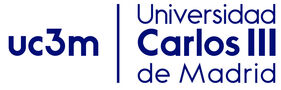
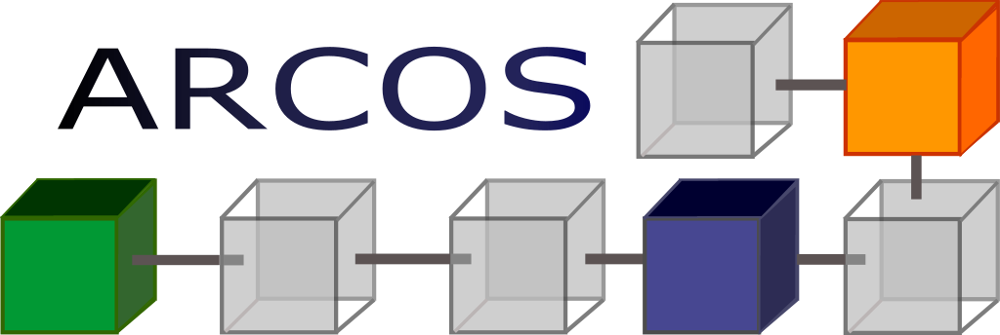
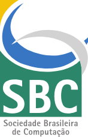

---
hide:
  - navigation
  - toc
  - title
---

# 

<!-- # SBAC-PAD 2026

<h2> 38th IEEE/SBC International Symposium on Computer Architecture and High Performance Computing </h2>

<h2> October 14-16, 2026 </h2> -->

/// html | div[style='flex: 3 1 60%; padding: 0 10px; min-width: 300px; float: left;width: 60%;']
The International Symposium on Computer Architecture and High Performance Computing (SBAC-PAD) is an annual international conference series, the first of which was held in 1987. Each conference has traditionally presented new developments in high performance applications, as well as the latest trends in computer architecture and parallel and distributed technologies. The conference has strong international participation, with submissions typically coming from over a dozen countries. The selection process is competitive, with acceptance rate below 30% in recent years. In this edition, the symposium will be held at Madrid, Spain by the University Carlos III of Madrid.

Madrid is the capital of Spain, and is home to the Spanish Royal family as well as the Spanish Government. It is a modern metropolitan city and an economical and industrial center of Spain, and, with its population of nearly 3,5 million people, is also the biggest city in Spain.

It is located in the centre of the Iberian Peninsula, and is surrounded by mountains and natural parks. Although it is located in the centre of the country, it has traditionally been the hub between different areas of Spain and is therefore connected to all major Spanish cities by train, road or air. The weather in Madrid varies a lot depending on the season (hot and dry in the summer).

The city is full of great monuments, like the royal palace, the Plaza Mayor or the many statuettes, and for people interested in art, the museums Del Prado, Reina Sofia or Thyssen have some of the most fantastic collections of famous Spanish painters like Velazquez, Goya, Picasso or Miro.

///

/// html | div[style='flex: 1 1 30%; padding: 0 10px; min-width: 250px; float: right;width: 30%;']
#### Important dates
::timeline::
[
    {
        "title": "Workshop and Tutorials Submissions",
        "content": "",
        "icon": ":material-flask-outline:",
        "sub_title": "April 15, 2026"
    },
    {
        "title": "Abstract submission",
        "content": "",
        "icon": ":material-text-box:",
        "key": "cyan",
        "sub_title": "July 1, 2026"
    },
    {
        "title": "Paper submission",
        "content": "",
        "icon": ":material-file-document-outline:",
        "sub_title": "July 9, 2026"
    },
    {
        "title": "Conference",
        "content": "Madrid, Spain",
        "icon": ":material-calendar:",
        "sub_title": "October 14-16, 2026"
    }
]
::/timeline::
///

/// html | div[style='clear: both;']
///

<video controls>
<source src="assets/videos/Madrid.mp4" type="video/mp4">
</video>

## Organized by

- <a href="https://www.uc3m.es/Home" target="_blank" rel="University Carlos III of Madrid">{width=300px }</a>
 
- <a href="https://www.uc3m.es/research-groups/arcos" target="_blank" rel="ARCOS research group">{ width=300px}</a>

<!-- 
::cards::

[
  {
    "title": "University Carlos III of Madrid",
    "content": "",
    "image": "assets/imgs/uc3m.jpg",
    "url": "https://www.uc3m.es/Home"
  },
  {
    "title": "ARCOS research group",
    "content": "",
    "image": "assets/imgs/logo-arcos.png",
    "url":"https://www.uc3m.es/research-groups/arcos"
  }
]

::/cards:: -->

## Promoted by

- <a href="https://www.sbc.org.br/" target="_blank" rel="SBC logo">{width=100px}</a>
 
- <a href="https://www.computer.org/" target="_blank" rel="IEEE logo">{ width=300px}</a>

- <a href="https://www2.sbc.org.br/ce-acpad/" target="_blank" rel="CEACPAD logo">{ width=300px}</a>

<!-- ::cards:: 

- title: 
  content: 
  image:
    url: ./assets/imgs/sbc_alt.png
    alt: SBC logo
    width: 30%
  url: "https://www.sbc.org.br/"

- title: 
  content: 
  image:
    url: ./assets/imgs/sponsor_IEEE-1024x313.png
    alt: IEEE logo
  url: "https://www.computer.org/"

- title: 
  content: 
  image:
    url: ./assets/imgs/CEACPAD-LOGOTIPO-PRINCIPAL-01.png
    alt: CEACPAD logo
    width: 80%
::/cards::
 -->
